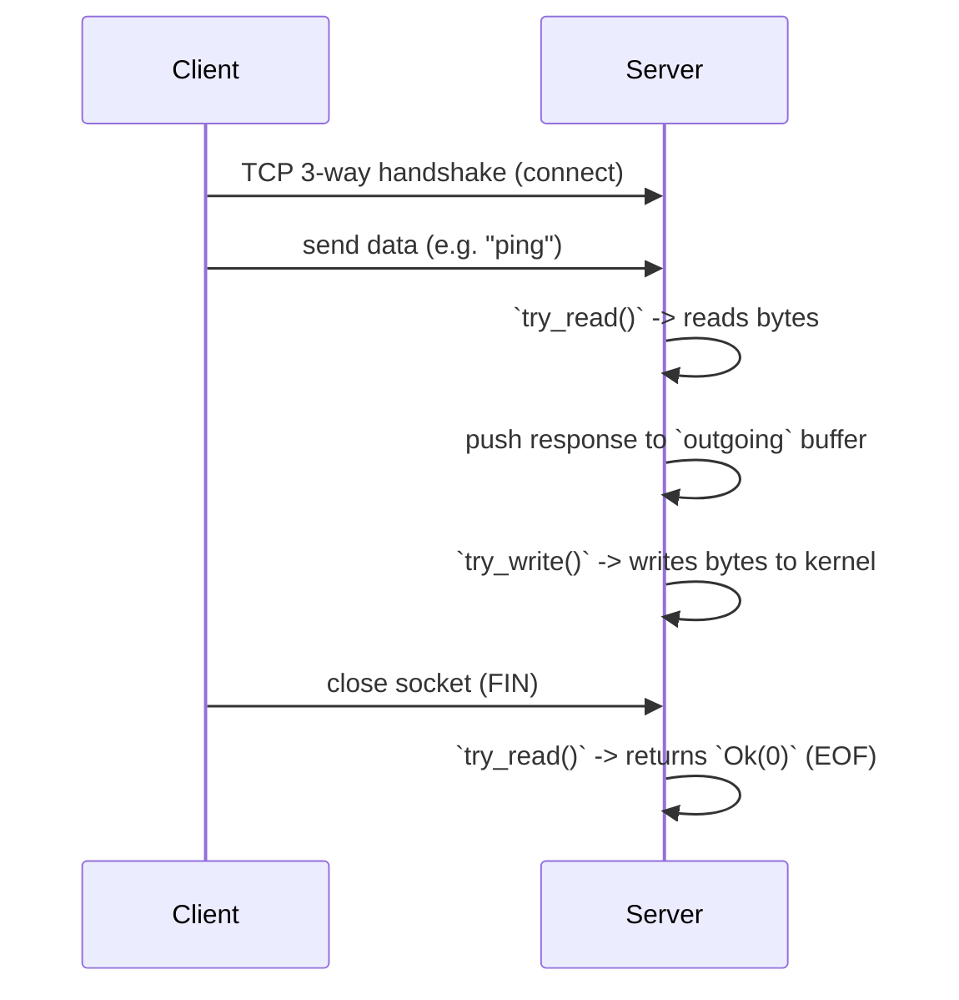

# Connection Lifecycle and Core Concepts

## Overview

This document explains the foundational abstractions of a TCP connection: how the OS represents it, how your application references it, and the typical lifecycle of establishing, communicating, and closing a socket.

---

## Part 1: The Core Picture

### 1. The Kernel, The Handle, and The Wrapper

To work with network connections, you deal with three layers of abstraction:

- **Socket (kernel)**: The OS's internal object that holds the protocol state (addresses, ports, TCP state machine, buffers). It lives entirely in kernel memory.
- **File Descriptor / Handle (OS)**: An integer (on Unix) or opaque HANDLE (on Windows) that acts as a secure "pointer" to the kernel socket. The OS gives your process this integer so you can request operations on the socket (like `read` or `write`).
- **`TcpStream` (Rust)**: A safe standard library wrapper that owns the file descriptor. It provides Rust-friendly methods (like `.read()`) that safely call into the underlying OS system calls.


When you drop the `TcpStream` in Rust, it automatically asks the OS to close the file descriptor, and the kernel subsequently begins closing the socket.

### 2. High-Level Connection Lifecycle
Here is a sequence of how a typical application interacts with a socket over its lifetime:



---

## Part 2: Deep Dive Details & Event-Loop Semantics

### Blocking vs Non-Blocking I/O
By default, sockets are **blocking**. If you call `.read()` and the kernel's receive buffer is empty, your thread goes to sleep until the network delivers data. 

In a high-performance server handling many clients, sleeping is unacceptable. We set sockets to **non-blocking** mode (`stream.set_nonblocking(true)`). In this mode, if there's no data, the OS immediately returns an error called `WouldBlock` (or `EAGAIN` in C). It literally means "I *would* have blocked, but you told me not to. Try again later."

### The `poll`-driven Model in `Conn`
Because you can't just blindly loop calling `read()` without wasting 100% of your CPU, applications use a `poll` mechanism. In this codebase:

- The `Conn` struct stores the `TcpStream` plus two intent flags: `want_read` and `want_write`.
- The event loop asks the OS, "Wake me up if the socket becomes readable or writable," based on these flags.
- When the OS signals readability, `try_read()` is called. When writable, `try_write()` is called.

### Read and Write Contracts

#### Handling `.read()`
- `Ok(n)` where `n > 0`: `n` bytes were successfully read.
- `Ok(0)`: The peer safely closed the connection (sent a `FIN`). This is known as EOF (End of File).
- `Err(e)` where `e.kind() == WouldBlock`: Nothing to read right now. Wait for the OS to signal `POLLIN`.
- `Err(e)`: A fatal connection error (like a reset).

```rust
// Typical non-blocking read pattern
match stream.read(&mut buf) {
    Ok(0) => { /* peer closed connection cleanly (EOF) */ }
    Ok(n) => { /* process n bytes of data */ }
    Err(e) if e.kind() == std::io::ErrorKind::WouldBlock => { /* try later */ }
    Err(e) => { /* fatal I/O error */ }
}
```

#### Handling `.write()`
- `Ok(n)`: `n` bytes were accepted by the kernel's Send Buffer. *Important: it might be fewer bytes than you asked to write!* You must remove those `n` bytes from your application buffer and try sending the rest later.
- `Err(e)` where `e.kind() == WouldBlock`: The kernel Send Buffer is full. Wait for the OS to signal `POLLOUT`.

```rust
// Typical non-blocking partial write pattern
let n = stream.write(&outgoing)?;
outgoing.drain(..n);
if outgoing.is_empty() { 
    /* we sent everything, stop polling for writes */ 
}
```

---
*Related docs: [Kernel Socket Mechanics](kernel_socket_mechanics.md) | [Implementation: Conn](../implementation/conn.md)*
