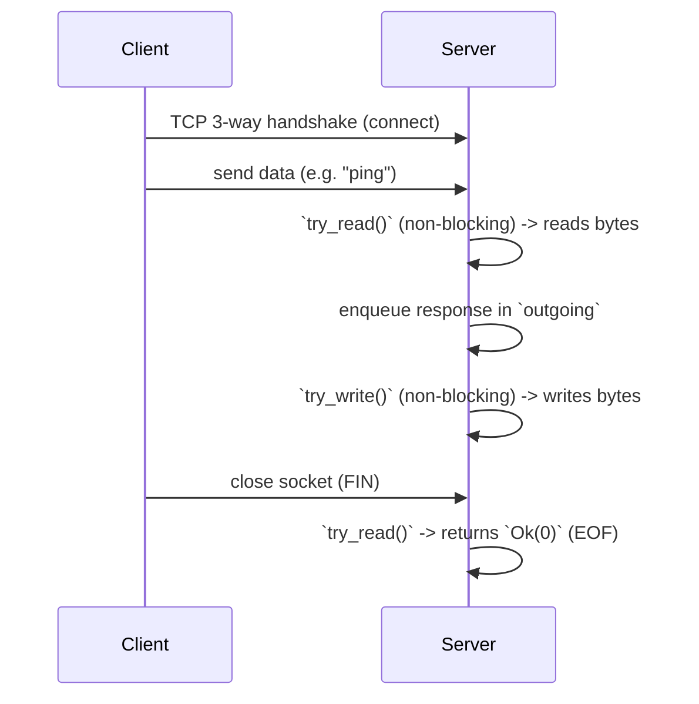

# Connection lifecycle and core concepts

This document explains how a TCP connection is represented and managed in this codebase, and diagrams the typical lifecycle from listen→accept→read/write→close.

**Key concepts**

- Socket (kernel): the OS's network endpoint that holds protocol state (addresses, ports, TCP state machine).
- File descriptor / handle: a process-level reference to the kernel socket (an integer on Unix, an opaque HANDLE on Windows).
- `TcpStream` (Rust): a safe stdlib wrapper that owns the OS handle and provides `Read`/`Write`, `set_nonblocking`, etc.
- Blocking vs non-blocking: blocking I/O waits until data/space is available; non-blocking returns `WouldBlock` if operation would block.
- EOF / FIN: a read that returns `Ok(0)` means the peer closed the connection (received FIN).

**How these map together**

1. The kernel maintains the socket object and TCP state.
2. The process obtains a file descriptor (FD) that references that socket.
3. `TcpStream` wraps the FD, providing Rust methods that call into the OS (e.g. `read`, `write`).
4. Dropping the last `TcpStream` closes the FD and the socket.

**Typical lifecycle (high-level)**



**Poll-driven connection model used in `Conn`**

- `Conn` stores the `TcpStream` plus two intent flags: `want_read` and `want_write`.
- The event loop asks the OS (via some poll/epoll/kqueue wrapper) whether the FD is readable or writable, based on these flags.
- When the OS signals readability, `try_read()` is called; when writable, `try_write()` is called.
- `try_read()` reads into an internal `incoming` buffer and may place data into `outgoing` for sending later. If no data is available in non-blocking mode, it yields an error with kind `WouldBlock`.
- `try_write()` attempts to flush `outgoing` to the socket. Partial writes remove the prefix of `outgoing` and leave the remainder for the next writable event.

**Notes & examples**

- `read` contract:

  - `Ok(n)` with `n > 0`: `n` bytes were read and appended to `incoming`.
  - `Ok(0)`: peer closed connection (EOF).
  - `Err(e)` with `e.kind() == WouldBlock`: no data now in non-blocking mode — try again when signaled.

- `write` contract:

  - `Ok(n)` with `n >= 0`: `n` bytes were written; callers should remove those bytes from `outgoing`.
  - `Err(e)` with `WouldBlock`: socket cannot accept data now — wait for writable notification.

**Flowchart: socket ↔ fd ↔ TcpStream**


**Small code snippets (semantics)**

- Detect EOF in `try_read()`:

```rust
match stream.read(&mut buf) {
    Ok(0) => { /* peer closed connection */ }
    Ok(n) => { /* n bytes read */ }
    Err(e) if e.kind() == std::io::ErrorKind::WouldBlock => { /* try later */ }
    Err(e) => { /* fatal I/O error */ }
}
```

- Handle partial writes in `try_write()`:

```rust
let n = stream.write(&outgoing)?;
outgoing.drain(..n);
if outgoing.is_empty() { /* we can stop polling for write */ }
```

**Next steps (ideas)**

- Add this doc to README navigation.
- Expand with platform-specific notes (Windows handles vs Unix FDs) and how `TcpStream::try_clone()` maps to FD duplication.

---

File created at: docs/connection_lifecycle.md
