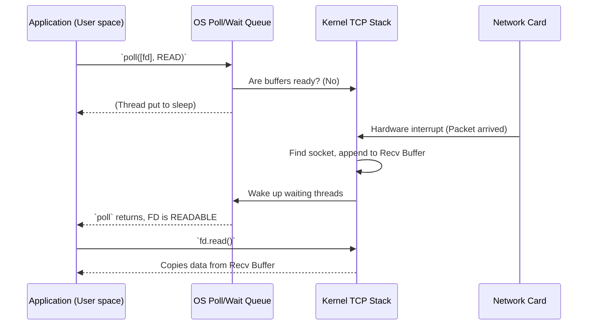

# Kernel Socket Mechanics, Buffers, and Polling

**Audience**: Learners exploring systems programming and TCP/IP mechanics.
**Prerequisites**: Familiarity with file descriptors and the basics of a TCP connection.
**Status**: Reviewed

## Overview
When you interact with a TCP socket in applications, you are exchanging data with kernel-level subsystems. This document explains what exactly resides in the kernel, how data physically moves from application buffers to the wire, and how the OS becomes "aware" of data so that it can wake up a polling application.

---

## Part 1: The Core Picture

### 1. The Kernel Socket
A connected TCP socket already strictly maps to a single local IP/port and a remote IP/port. The kernel doesn't need to append target addresses to every byte of data you send; the socket struct *implies* the route. 

Alongside tracking the connection lifecycle (e.g., `ESTABLISHED`, `CLOSE_WAIT`), the OS maintains two distinct memory buffers for every TCP connection:
- **Send Buffer (Send-Q)**: Holds bytes the application wants to send, but the network hasn't delivered or the peer hasn't acknowledged yet.
- **Receive Buffer (Recv-Q)**: Holds bytes the network has received, but the application hasn't `read()` yet.

### 2. Writing Data (Application to Wire)
When you call `stream.write(b"hello")`:
1. **To the Buffer**: The bytes are handed to the kernel and appended to the socket's Send Buffer.
2. **Chunking**: The kernel's TCP/IP stack asynchronously takes chunks of bytes from this buffer, wraps them in TCP headers (adding sequence numbers), wraps *that* in IP headers, and passes it to the network interface card (NIC) driver.
3. **Out to the Network**: The NIC converts these frames into electrical signals to send over the wire.
4. **Waiting for ACK**: The kernel keeps a copy of those bytes in the send buffer until it receives a TCP `ACK` from the peer. Once ACKed, the kernel drops the local copy to free up space.

### 3. Receiving Data (Wire to Application)
When data arrives over the wire:
1. **From the Network**: The NIC receives frames, uses Direct Memory Access (DMA) to put them into RAM, and triggers a hardware interrupt.
2. **Parsing**: The kernel's network driver wakes up, parses the IP and TCP headers, and uses the ports & IPs to find the matching socket struct.
3. **To the Buffer**: The payload is appended to that socket's Receive Buffer.
4. **Waking the App**: The kernel updates the socket's internal state to indicate it is **readable**. If any application threads were asleep waiting for this socket, the kernel wakes them up.

### 4. How Polling Works
Event loops (like `poll`) bridge the gap between kernel state and user-space code without "busy waiting".

When you call `poll([fds])`, the kernel iterates through your file descriptors. It checks:
- Is there unread data in the Receive Buffer? -> Mark `POLLIN` (readable).
- Is there free space in the Send Buffer? -> Mark `POLLOUT` (writable).

If neither is true, the kernel puts your thread to sleep. It only wakes you up when the NIC delivers new network packets that change these buffer states, as seen in the diagram above.

---

## Part 2: Deep Dive Details & Edge Cases

The following details expand on the core outline to explain network quirks, blocking behaviors, and protocol teardown.

### Buffer Limits and Blocking
Because TCP guarantees reliable delivery, the OS *must* keep a copy of your sent data until it receives an `ACK` from the peer. If you application generates data faster than the network can transmit it, the Send Buffer will fill up (hitting its "high watermark"). 

When there is no space left, the OS cannot accept more bytes. Calling `write()` at this point will either block (putting your thread to sleep until space frees up) or return `WouldBlock`/`EAGAIN` (if the socket is set to non-blocking mode). 

### TCP Payload Chunks (MSS)
In Step 2 of "Writing Data", the kernel slices your data into chunks. The size of these chunks is primarily determined by the **Maximum Segment Size (MSS)** negotiated during the handshake. This is usually derived from the network's MTU (Maximum Transmission Unit, typically 1500 bytes for standard Ethernet). The TCP payload is MTU minus the IP and TCP headers (resulting in ~1460 bytes for the actual payload). 

### Understanding Watermarks and Small Messages
When the OS checks if a socket is ready for polling, it relies on system thresholds known as "watermarks". The term means two different things depending on direction:

- **Receive Low Watermark (`SO_RCVLOWAT`)**: This applies to incoming data. By default, the OS sets this to **exactly 1 byte**. If there is even a single byte sitting in the receive buffer, `poll` considers the socket readable and wakes up your application. You do not have to worry about tiny "valuable" messages getting stuck below the threshold; no data gets trapped.
- **Send Low Watermark (`SO_SNDLOWAT`)**: This applies to outgoing data, and it measures **FREE SPACE** to write into, not the data itself. If you completely fill the send buffer, `poll` stops telling you the socket is writable. As the network transmits your data, small chunks of space open up. If `poll` woke your app up every time just 1 byte of space opened up, you would waste massive CPU cycles doing 1-byte `write()` calls. Instead, the OS waits until the free space crosses the "send low watermark" (often a larger chunk, like 2KB) before it marks the socket as `POLLOUT` (writable) again.

### The Anatomy of an EOF
An EOF (End of File) is **not** an empty string payload or a special byte sequence. It happens at the protocol header level.

1. When the peer application explicitly shuts down, its OS sends a TCP packet with the **`FIN` (Finish) control bit** set in the TCP header. 
2. The receiving kernel reads the `FIN` packet and internally records that the opposite side is done sending data.
3. The local application continues calling `read()`. It will read any remaining data sitting in the Receive Buffer.
4. Once the Receive Buffer is completely empty *and* the kernel knows a `FIN` was received, the kernel forces `read()` to return `0` bytes immediately.
5. In Rust, `std::io::Read` maps this zero-byte return to `Ok(0)`, which is how your app definitively knows it has hit EOF.

---
*Related docs: [Connection Lifecycle](connection_lifecycle.md) | [TCP State Machine](tcp_state_machine.md)*
