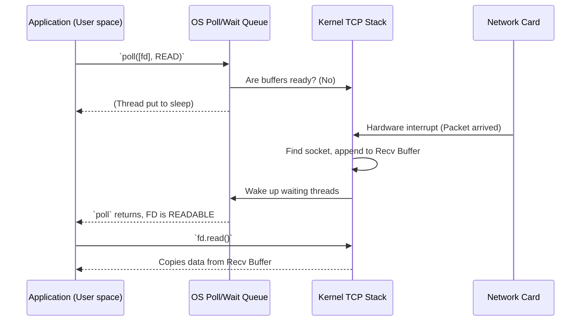

# Kernel Socket Mechanics, Buffers, and Polling

**Audience**: Learners exploring systems programming and TCP/IP mechanics.
**Prerequisites**: Familiarity with file descriptors and the basics of a TCP connection.
**Status**: Reviewed

## Overview
When you interact with a TCP socket in applications, you are exchanging data with kernel-level subsystems. This document answers what exactly resides in the kernel, how data physically moves from application buffers to the wire, how the OS becomes "aware" of data for polling, and what an EOF actually looks like at the protocol level.

## 1. The Kernel Socket and the State Machine

You might assume the TCP state machine strictly tracks "does this socket have data?" but it actually tracks the **lifecycle** of the connection itself (e.g., `LISTEN`, `SYN_SENT`, `ESTABLISHED`, `FIN_WAIT`, `CLOSE_WAIT`).

Alongside the state machine, the kernel maintains two distinct memory buffers for every TCP connection:
- **Send Buffer (Send-Q)**: Holds bytes the application has written but the network hasn't definitively sent or gotten acknowledged yet.
- **Receive Buffer (Recv-Q)**: Holds bytes received from the network that the application hasn't `read()` yet.

Because TCP is connection-oriented, a connected socket already strictly maps to a single local IP/port and remote IP/port. The kernel doesn't need to append target addresses to every byte in the buffer; the socket *implies* the route.

## 2. Writing Data (Application to Wire)

When you call `stream.write(b"hello")`:
1. The bytes are handed to the kernel and appended to the socket's **Send Buffer**.
2. If the send buffer is full (or hits a watermark), `write()` either blocks or returns `WouldBlock`/`EAGAIN` (in non-blocking mode).
3. The kernel's TCP/IP stack asynchronously takes chunks of bytes from this buffer, wraps them in TCP headers (adding sequence numbers), wraps *that* in IP headers, and passes it to the network interface card (NIC) driver to be sent as Ethernet frames.
4. The kernel keeps a copy of those bytes in the send buffer until it receives a TCP `ACK` from the peer. Once ACKed, the kernel drops them to free up space.

## 3. Receiving Data and OS Awareness

When data arrives over the wire:
1. The NIC receives electrical signals/frames and uses Direct Memory Access (DMA) to put them into RAM, then triggers a hardware interrupt.
2. The kernel's network driver wakes up, parses the IP and TCP headers, and uses the source/destination ports & IPs to find the matching socket struct.
3. The payload is appended to that socket's **Receive Buffer**.
4. The kernel updates the socket's internal state to indicate it is **readable**. If any threads were asleep waiting for this socket, the kernel wakes them up.

## 4. How `poll` Actually Works

Event mechanisms like `poll()` bridge the gap between kernel state and user-space.

When you call `poll(fds, ...)`:
1. The kernel iterates through the array of file descriptors you provided.
2. For each FD, the kernel invokes an internal polling function specific to that file type. For TCP sockets, it checks things like:
   - *Is the Receive Buffer non-empty (above a "low watermark")?* -> Mark `POLLIN` (readable).
   - *Is there free space in the Send Buffer?* -> Mark `POLLOUT` (writable).
   - *Has a connection error or state change occurred?* -> Mark `POLLERR` or `POLLHUP`.
3. If **none** of the FDs are ready, the kernel puts your thread to sleep and adds a callback onto the wait queues of those sockets.
4. Later, when the NIC receives a packet and the kernel appends it to a Receive Buffer (as in Step 3), the kernel sees your thread waiting, wakes it up, and `poll()` returns, telling you which FDs are now ready.

## 5. The Anatomy of an EOF

An EOF (End of File) is **not** an empty string payload or a special byte sequence. It happens at the protocol header level.

1. When the peer application drops its connection or explicitly shuts it down, its OS sends a TCP packet with the **`FIN` (Finish) control bit** set in the TCP header. There is usually no payload data in this packet.
2. The receiving kernel reads the `FIN` packet and records in its TCP state machine that the opposite side is done sending data.
3. The local application continues calling `read()`. It will read any remaining data sitting in the Receive Buffer.
4. Once the Receive Buffer is completely empty *and* the kernel knows a `FIN` was received, the kernel makes `read()` return `0` bytes immediately.
5. In Rust, `std::io::Read` maps this zero-byte return to `Ok(0)`, which is how your app definitively knows it has hit EOF.

---
*Related docs: [Connection Lifecycle](connection_lifecycle.md)*
