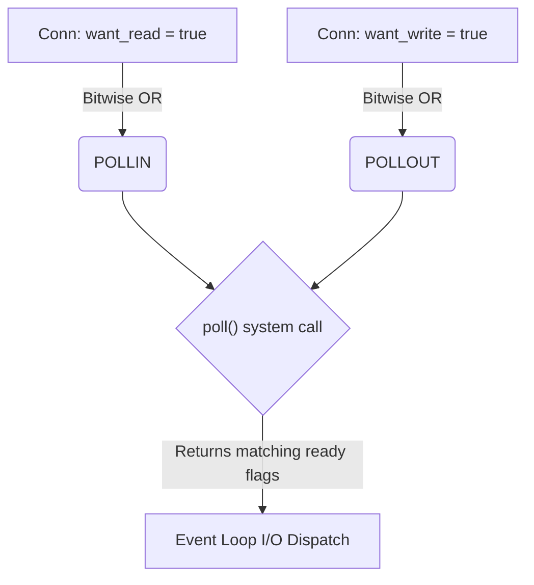

# Poll Flags: The Event Loop Vocabulary

## Part 1: The Core Picture

### What are Poll Flags?

When we use the `poll()` system call to wait for events on multiple sockets simultaneously, we communicate with the kernel using "poll flags" (represented in Rust via `nix::poll::PollFlags`). 

These flags act as a bi-directional vocabulary consisting of:

1. **Input Flags (`events`):** What we *ask* the kernel to monitor (e.g., "Tell me when I can read").
2. **Output Flags (`revents`):** What the kernel *responds* with (e.g., "You can read now," or "The connection died").

### The Two Main Actors: `POLLIN` and `POLLOUT`

In standard TCP server programming, we orchestrate I/O primarily using two basic input flags. We bitwise `OR` these flags together to build our request to the kernel.

#### 1. `POLLIN` (Poll In)

* **Meaning:** The socket has data available to read without blocking.
* **When to request it:** Set this when your `Conn` wrapper has `want_read = true` (which is almost always for an established connection).
* **Special Case:** On a *listening* socket (the one bound to a port, waiting for clients), `POLLIN` means a new client connection is ready to be accepted via the `accept()` system call.

#### 2. `POLLOUT` (Poll Out)

* **Meaning:** The socket is ready to accept writes without blocking. The kernel's send buffer has enough free space limit (specifically, more than the `SO_SNDLOWAT` watermark).
* **When to request it:** Set this when your `Conn` has `want_write = true` (i.e., you have buffered data ready to send back to the client).



---

## Part 2: Deep Dive Details

### Anatomy of `revents` and the `pollfd` Struct

When we talk about "output flags," they are technically returned in a field called **`revents`** (Returned Events or Received Events).

Under the hood, when you call `poll()`, you pass the kernel an array of structs (one for each connection). In C, this struct looks exactly like this:

```c
struct pollfd {
    int fd;         // The socket file descriptor (4 bytes)
    short events;   // The flags you ASK the kernel to monitor (Input) (2 bytes)
    short revents;  // The flags the kernel WRITES BACK (Output) (2 bytes)
};
```

> **Why 16-bit (`short`) instead of 8-bit (`char`)?**
>
> 1. Even though the main TCP flags seemingly fit in 6 bits, POSIX and Linux define many esoteric extended flags (like `POLLRDHUP` or `POLLRDBAND`) that require the extra bits.
> 2. CPU *alignment*. Notice that 4 bytes + 2 bytes + 2 bytes = 8 bytes. The struct fits perfectly into an 8-byte aligned word. Using a 1-byte flag would just force the C compiler to secretly waste space padding it to match CPU alignments anyway!

1. **You build a list:** You create an array filled with `fd`s and your requested `events`. You leave `revents` empty (or 0).
2. **You call `poll()`:** The OS blocks your program, putting it to sleep.
3. **The OS wakes you up:** Once network activity happens (or a timeout occurs), the OS fills in the `revents` field with the flags of what actually happened, and hands control back to you.
4. **You loop through the list:** You iterate over your array and check the `revents` field for each `fd` to handle `POLLIN`, `POLLOUT`, `POLLHUP`, etc.

The Rust `nix` crate abstracts this safely into the `PollFd` wrapper, but the mechanic is identical:

```rust
// 1. Create an array of PollFd items (fd + events)
let mut fds = [
    nix::poll::PollFd::new(fd1, PollFlags::POLLIN),
    nix::poll::PollFd::new(fd2, PollFlags::POLLIN | PollFlags::POLLOUT),
];

// 2. Hand the whole array to the OS
nix::poll::poll(&mut fds, timeout)?;

// 3 & 4. Check what the OS wrote back into the revents field
for poll_fd in fds.iter() {
    if let Some(revents) = poll_fd.revents() {
        if revents.contains(PollFlags::POLLIN) {
            // fd is ready to read!
        }
    }
}
```

### The Bitmasking Mechanic

These flags behave exactly like Unix file permissions (`chmod 755` mapping to `rwxr-xr-x`). The `events` and `revents` fields are 16-bit integers (`short` in C, `i16` in Rust), and each flag is a constant representing a single bit set to `1`:

```c
#define POLLIN     0x0001  // Binary: 0000 0000 0000 0001
#define POLLPRI    0x0002  // Binary: 0000 0000 0000 0010
#define POLLOUT    0x0004  // Binary: 0000 0000 0000 0100
#define POLLERR    0x0008  // Binary: 0000 0000 0000 1000
#define POLLHUP    0x0010  // Binary: 0000 0000 0001 0000
#define POLLNVAL   0x0020  // Binary: 0000 0000 0010 0000
```

#### Bitwise OR (`|`) to Request Flags

When preparing our request, we use the bitwise OR operator to merge distinct bits into a single integer package for the kernel:

```text
    0000 0000 0000 0001  (POLLIN)
|   0000 0000 0000 0100  (POLLOUT)
-----------------------
    0000 0000 0000 0101  (Your events bitmask: 5)
```

#### Bitwise AND (`&`) to Read Results

When the kernel returns the `revents` integer, functions like `.contains()` or `.intersects()` in Rust's `nix` crate use a bitwise AND to check if a specific bit is turned on:

```rust
// How `revents.contains(POLLIN)` works internally:
if (revents & POLLIN) != 0 {
    // 0000 0000 0000 0101 (revents)
    // 0000 0000 0000 0001 (POLLIN mask)
    // ------------------- (Bitwise AND)
    // 0000 0000 0000 0001 (Result is not 0, so POLLIN is set!)
}
```

### The Uninvited Flags (Output-Only)

Even if you only specifically ask the kernel for `POLLIN` or `POLLOUT`, it can unconditionally return status flags in the output `revents` to notify you of connection state changes. You must actively check for these during the event loop dispatch phase.

#### `POLLHUP` (Poll Hang-Up)

* **Meaning:** The peer has gracefully closed their side of the connection (they sent a TCP `FIN` packet).
* **Action:** You can still safely read any remaining data that was in flight before the `FIN` arrived. Once your `read()` call returns `0` (the standard EOF signal), you should close your side of the socket.

#### `POLLERR` (Poll Error)

* **Meaning:** An asynchronous error occurred on the socket. Often this means a TCP `RST` (Reset) packet was received, abruptly dropping the connection, or a network timeout occurred.
* **Action:** The socket is dead. Close the file descriptor and clean up associated memory immediately.

#### `POLLNVAL` (Poll Invalid)

* **Meaning:** The file descriptor given to `poll()` is not open (or is completely invalid).
* **Action:** This indicates a logic bug in the event loop code (e.g., you dropped a connection and closed its socket, but forgot to remove its fd from the `poll` active list).

### Putting It Together: The Event Loop Mapping

In RedRust, mapping `Conn` intent through `poll` to execution looks like this:

```rust
use nix::poll::PollFlags;

// 1. Build the request flags (what we tell the Kernel)
let mut request_flags = PollFlags::empty();
if conn.want_read {
    request_flags |= PollFlags::POLLIN;
}
if conn.want_write {
    request_flags |= PollFlags::POLLOUT;
}

// ... Kernel sleeps and executes poll() until activity ...

// 2. Dispatch the result (what the Kernel tells us)
let revents = /* flags returned by poll for this connection */;

// Handle normal I/O
if revents.contains(PollFlags::POLLIN) {
    conn.read_non_blocking(); // Safe to try reading
}
if revents.contains(PollFlags::POLLOUT) {
    conn.write_non_blocking(); // Safe to try writing
}

// Handle lifecycle disconnects and errors
if revents.intersects(PollFlags::POLLERR | PollFlags::POLLHUP | PollFlags::POLLNVAL) {
    // The socket is essentially dead or dying.
    // Clean up connection references and close the fd.
    server.remove_connection(conn.fd);
}
```
