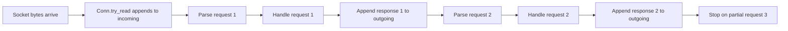

# Stream Buffers, Framing, and Pipelining

## Overview

TCP gives your application a **stream of bytes**, not a series of neatly separated messages. This document explains how those bytes move from the socket into a connection buffer, how we carve that stream into complete requests, and why pipelining changes how an event loop should think about `read` and `write`.

---

## Part 1: The Core Picture

### 1. TCP is a Byte Stream, Not a Message Queue

When a client sends three requests, the server kernel does **not** preserve them as three separate "envelopes." It just stores incoming bytes in order.

That means one application `read()` call might observe:

- half of one request
- exactly one request
- several full requests at once
- several requests plus the beginning of the next one

This is the core mental shift:

> A readable socket only means "some bytes are available." It does **not** mean "exactly one complete request is ready."

### 2. The Loading Dock Analogy

A useful analogy is a warehouse loading dock:

- **TCP stream / socket**: the truck arriving at the warehouse
- **`try_read()`**: unloading cargo from the truck
- **`incoming` buffer**: the loading dock floor
- **request parsing**: sorting cargo on the dock into complete packages
- **request handler**: workers deciding what each package means
- **`outgoing` buffer**: finished shipments staged for pickup
- **`try_write()`**: loading outbound shipments onto the truck

The important sequence is:

1. unload raw bytes from the socket into `incoming`
2. inspect `incoming` for complete requests
3. handle each complete request
4. append response bytes to `outgoing`
5. write as much of `outgoing` as the socket will accept

### 3. The Three Practical Layers

Even in a tiny Redis-like server, there are really three layers of work:

1. **Transport**: moving bytes in and out of the socket
2. **Framing / Parsing**: deciding where one request ends and the next begins
3. **Application Handling**: deciding what response a parsed request should produce

In very small examples, these layers often appear blended together. But conceptually they are still separate.

### 4. A Concrete Buffer Example

Imagine the `incoming` buffer currently holds bytes shaped like this:

```text
[request1][request2][partial request3]
```

One parse pass should produce:

- parsed requests: `request1`, `request2`
- leftover bytes in `incoming`: `[partial request3]`

Those leftover bytes must remain in the connection state until a future socket read brings in the rest.



---

## Part 2: Deep Dive Details & Event-Loop Semantics

### Reading and Parsing are Different Jobs

It helps to name these steps separately:

#### `try_read()`
- Calls `stream.read(...)`
- Copies raw bytes from the kernel receive buffer into `Conn.incoming`
- Does **not** decide what those bytes mean

#### `try_parse_requests()`
- Examines bytes already sitting in `Conn.incoming`
- Extracts zero or more complete requests
- Leaves any incomplete trailing bytes behind

In Rust-like pseudocode:

```rust
conn.try_read()?; // move raw bytes from socket into incoming

let requests = conn.try_parse_requests()?; // carve incoming into messages

for req in requests {
    let resp = handle_request(req);
    conn.queue_response(&resp);
}

conn.try_write()?; // optional optimistic write
```

### Why Pipelining Changes the Design

**Pipelining** means the client can send multiple requests before reading any responses.

For example, the client may send:

```text
PING
ECHO hello
ECHO world
```

without waiting between them.

If the server only processes one request per readable event, the remaining already-buffered requests may sit around unnecessarily. In some designs, they can even stall waiting for another `POLLIN` wakeup that never needs to happen.

That is why a pipelining-friendly parser usually works like this:

```rust
while let Some(req) = conn.try_parse_one_request()? {
    let resp = handle_request(req);
    conn.queue_response(&resp);
}
```

The loop means:

- keep parsing while `incoming` already contains complete work
- stop only when the next request is incomplete

### Why `Conn` Should Usually Own Buffers but Not Business Meaning

`Conn` is a natural home for:

- the `TcpStream`
- `incoming` and `outgoing` buffers
- read/write readiness intent
- helpers for parsing framed requests out of raw bytes

`Conn` is usually **not** the best home for:

- Redis command semantics
- key/value lookups
- command dispatch
- application-specific response generation

That boundary gives you a healthy separation:

- `Conn` knows **how** bytes move and where message boundaries are
- the server or handler code knows **what** a parsed request means

In other words:

- `Conn` should know how to say "I found a full request"
- `main` or a handler module should know how to say "This request means `GET mykey`"

### Should `want_read` and `want_write` Flip Like a Binary State?

Usually, no.

They are better thought of as two separate interests:

- `want_read`: tell the kernel we care about readability
- `want_write`: tell the kernel we care about writability

They are **not** inherently mutually exclusive.

Common states:

- `want_read = true`, `want_write = false`
  - waiting for more client input
- `want_read = true`, `want_write = true`
  - we still want new input, and we also have buffered output to flush
- `want_read = false`, `want_write = true`
  - possible if we intentionally stop reading while draining output

In a pipelining-capable server, `want_read = true` and `want_write = true` at the same time is very normal.

### Why Partial Writes Matter Too

Just like reads can be partial, writes can be partial.

Calling `write(&outgoing)` might only accept some prefix of your bytes into the kernel send buffer.

So `Conn::try_write()` must:

1. attempt the write
2. remove only the bytes actually accepted
3. keep the unwritten tail in `outgoing`
4. continue polling for `POLLOUT` if bytes remain

That is why the connection has to preserve state across event loop turns in **both** directions:

- partial request bytes in `incoming`
- partial response bytes in `outgoing`

### One Reasonable First Architecture

For a small server, a nice first design is:

#### `Conn`
- `try_read()`
- `try_parse_one_request()` or `try_parse_requests()`
- `queue_response(...)`
- `try_write()`

#### Event loop / server layer
- asks `Conn` to read
- asks `Conn` for parsed requests
- handles each request
- queues responses back onto that same `Conn`

This keeps responsibilities clean without adding too much machinery too early.

### A Compact Summary

When building a pipelining-capable event loop, the most important ideas are:

- TCP gives you ordered bytes, not pre-separated messages
- `read()` moves bytes from the socket into your application buffer
- parsing happens **after** the bytes are in your buffer
- one buffer may contain zero, one, or many complete requests
- incomplete trailing bytes must stay in the connection for later
- responses may also need multiple writes to fully flush
- `Conn` should usually own transport state and framing helpers
- application code should usually own request meaning and response generation

---
*Related docs: [Connection Lifecycle](connection_lifecycle.md) | [Kernel Socket Mechanics](kernel_socket_mechanics.md) | [Poll Flags](poll_flags.md)*
