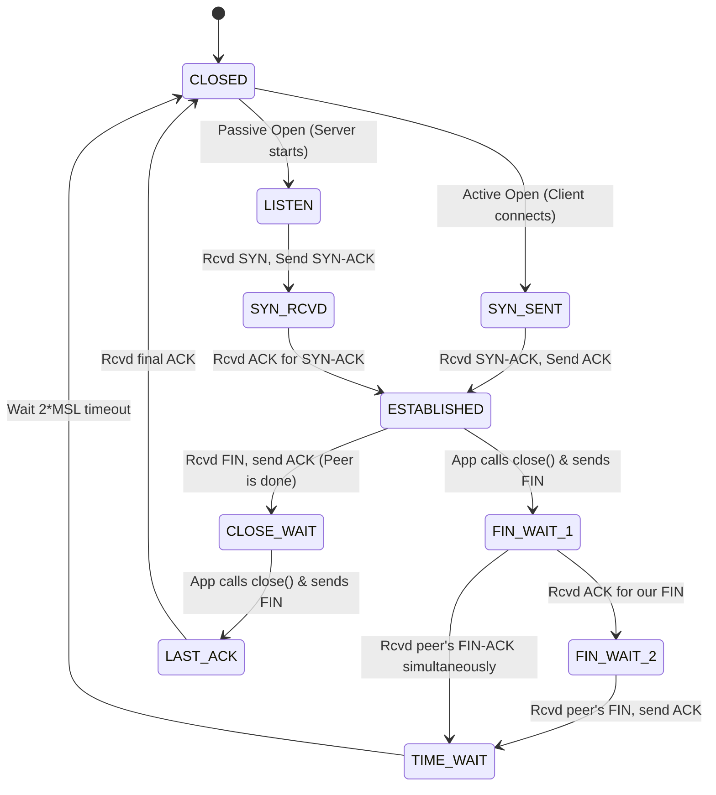

# TCP State Machine: The Lifecycle of a Connection

## Overview

Every TCP socket doesn't just hold data; it progresses through a strict mathematical state machine defined by the TCP protocol ([RFC 793](https://datatracker.ietf.org/doc/html/rfc793)). These states govern what headers are expected next, whether data can be sent, and how the connection is torn down safely.

---

## Part 1: The Core Picture

### The Standard TCP Lifecycle Map

Here is a visual map of the core TCP state machine showing how a connection sets up, establishes, and tears down.

### The 3 Core Phases

1. **Setup**: The 3-Way Handshake (`LISTEN`, `SYN_SENT`, `SYN_RCVD`). The two kernels establish starting sequence numbers to track byte order.
2. **Transfer**: `ESTABLISHED`. The handshake is complete. Both sides can freely send and receive data. **This is the state where typical `.read()` and `.write()` operations occur in your application.**
3. **Teardown**: The 4-Way Handshake. Because TCP is full-duplex (two-way), both sides must independently agree to stop and close their sending channels.

---

## Part 2: Deep Dive Details & Edge Cases

### Setup (The 3-Way Handshake) Details

Before any application data is sent, the two kernels must establish starting sequence numbers to track byte order. **SYN** stands for **Synchronize** (specifically, Synchronize Sequence Numbers).

1. **`CLOSED`**: A fictional state. The socket exists in the kernel but has no network activity.
2. **`LISTEN`**: A server socket that is waiting for incoming client connections (Passive open).
3. **`SYN_SENT`**: The client called `connect()` and sent a `SYN` packet ("let's synchronize our sequence numbers starting at X"). It is waiting for the server's reply.
4. **`SYN_RCVD`**: The server received the client's `SYN`, replied with a `SYN-ACK` ("got your X, let's synchronize your end to my Y"), and is waiting for the final `ACK` from the client.
5. **`ESTABLISHED`**: The client acknowledged the server's Y sequence number. Data transfer begins.

### Teardown (The 4-Way Handshake) Details

Closing a TCP connection is independent in both directions. One side can close its sending channel while still receiving data.

#### Active Close (The side that calls `close()` first)

1. **`FIN_WAIT_1`**: The application called `close()`. The kernel sent a `FIN` packet and is waiting for the peer to ACK it.
2. **`FIN_WAIT_2`**: The peer successfully received and ACKed our `FIN`. We are now waiting for the peer's application to finish its work and send *its* `FIN`.
3. **`TIME_WAIT`**: We received the peer's `FIN` and sent a final `ACK`. We now wait here for a set time (typically 2 minutes, "2x Maximum Segment Lifetime"). *Why?* If our final `ACK` was lost in transit, the peer will re-send its `FIN`. If we had already deleted the socket, we'd mistakenly reply with an RST (Reset). `TIME_WAIT` ensures a clean shutdown.

#### Passive Close (The side that is being disconnected)

1. **`CLOSE_WAIT`**: We received a `FIN` from the peer and the kernel auto-replied with an `ACK`. Our OS knows the peer is done sending, so `.read()` will now return EOF (`Ok(0)`). We wait in this state until our local application explicitly calls `close()` to finish up on our end.
2. **`LAST_ACK`**: Our application finally called `close()`. We sent our own `FIN` and are just waiting for the peer's final `ACK` before deleting the socket entirely.

### Diagnostic Tools

You can see these exact states in action on your machine if you ever use terminal networking tools:

- Run `netstat -an | grep tcp` (or `ss -ta` on Linux) to print out every active socket and its current state (`LISTEN`, `ESTABLISHED`, `TIME_WAIT`, etc.).

---
*Related docs: [Kernel Socket Mechanics](kernel_socket_mechanics.md)*
